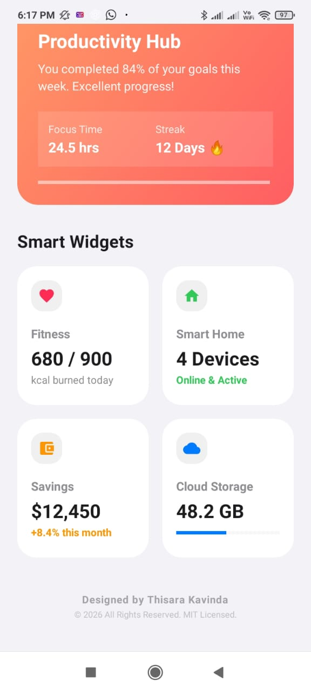
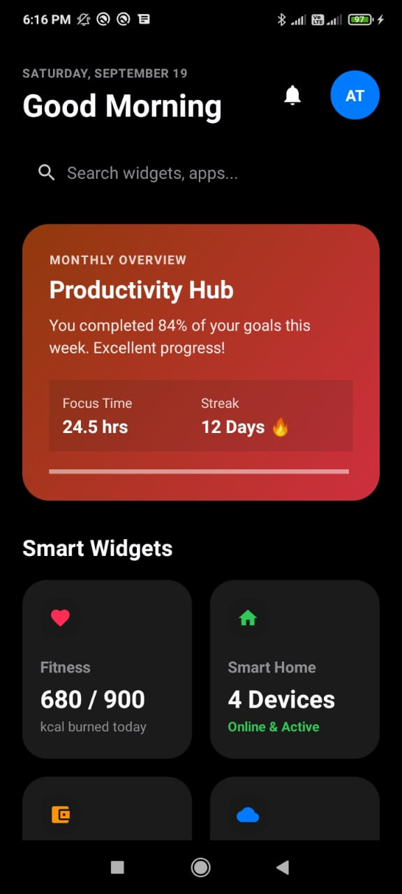
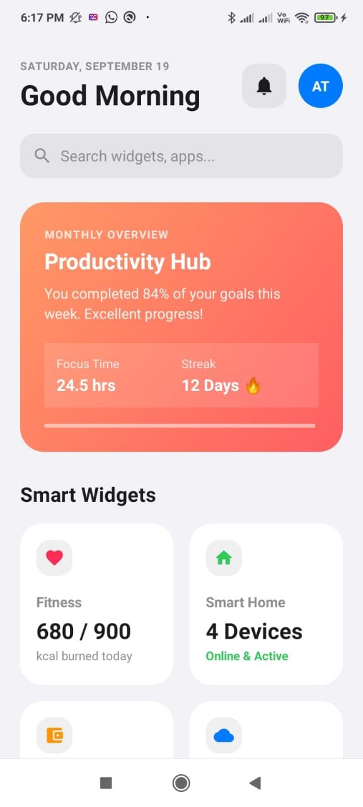
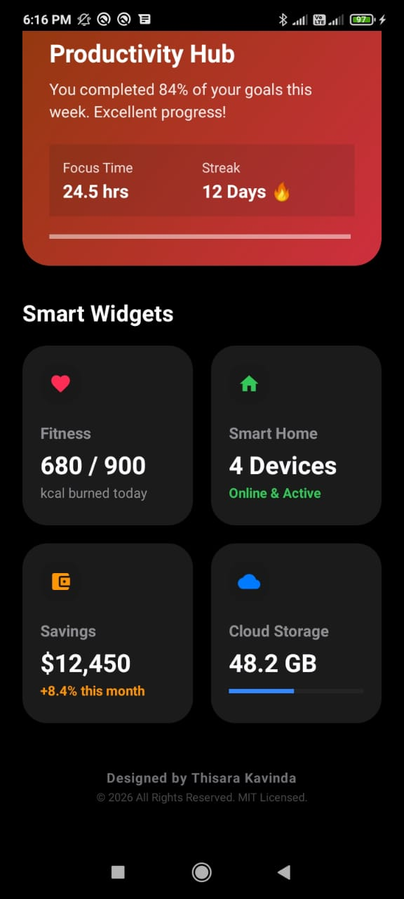

# Premium iOS-Style Dashboard UI for Android 📱✨

A high-performance, aesthetically pleasing Android Dashboard UI inspired by Apple's iOS design system. This project features fluid entrance animations, rolling numbers counters, dynamic content filling indicators, and tactile spring micro-interactions. Perfect as a premium portfolio piece!

## 🌟 Premium Features
- **Modern iOS Aesthetic:** Rounded squircle corners, soft translucent overlays, and bright premium iOS system colors with multi-tonal Day/Night themes.
- **Fluid Entrance Animation Wave:** Elements slide and fade sequentially into place when the application is launched.
- **Live Numeric Ticker Animation:** Numbers like *Focus Time* roll smoothly from `0.0` to `24.5 hrs` and *Streak Counters* tick up live to `12 Days` with native physics interpolators.
- **Dynamic Content Loading Indicator:** A sleek iOS progress indicator line expands dynamically up to `84%` once the card fully slides into position.
- **Tactile Spring Bounce Feedback:** Every single card and interactive icon scales down slightly upon pressing (`0.95f`) and snaps back into place using an `OvershootInterpolator` mimicking an organic iOS spring response.

## 🛠 Tech Stack & Architecture
- **Language:** Java / Native Android SDK
- **UI Components:** Custom XML layouts using advanced Material Design Components (`MaterialCardView`, immersive gradients).
- **Core Graphics:** Lightweight independent responsive Vector drawables (`.xml`).

## ⚙️ How It Works (Animation Core)
The micro-interactions are driven programmatically without bloat using native Android Framework utilities:
```java
ValueAnimator focusAnimator = ValueAnimator.ofFloat(0.0f, 24.5f);
focusAnimator.setInterpolator(new DecelerateInterpolator(1.5f));
focusAnimator.addUpdateListener(animation -> {
    float value = (float) animation.getAnimatedValue();
    tvCounterFocus.setText(String.format(Locale.US, "%.1f hrs", value));
});
```

## 📸 Interactive Showcase

Both Light Mode and Dark Mode layouts have been explicitly tuned to adhere to clean iOS aesthetics:

<p align="center">
  
  
</p>

<p align="center">
  
  
</p>

### 🎬 Live Micro-Interactions & Fluid Animations
Watch the staggered wave entrance, live rolling counters, and tactile spring feedback in action across both system modes:

<p align="center">
  <video src="screenshots/live_interactions_light.mp4" width="380" controls></video>
  ~ &nbsp; &nbsp; ~
  <video src="screenshots/live_interactions_dark.mp4" width="380" controls></video>
</p>

## ⚖️ License & Copyright
Copyright © 2026 **Thisara Kavinda**. 

This project is licensed under the **MIT License** - see the [LICENSE](LICENSE) file for details. You are absolutely free to copy, modify, and use this code in personal or commercial products as long as you provide clear attribution to the original author.

---
Developed with ❤️ by [Thisara Kavinda](https://github.com/thisarakavindax) 🚀